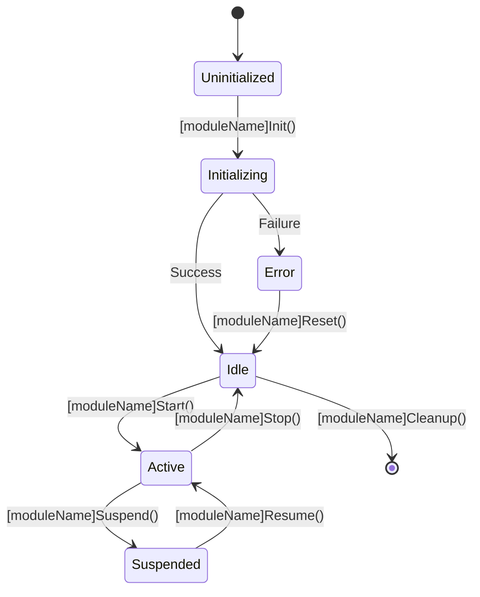

# [MODULE_NAME] Module Documentation

> **Project:** ESP32S3 CAN to Modbus TCP Bridge  
> **Module:** [MODULE_DESCRIPTION]  
> **Version:** v[VERSION]  
> **Created:** [DATE] (Warsaw Time)  
> **Last Updated:** [DATE] (Warsaw Time)

## 📋 Overview

[DETAILED_MODULE_OVERVIEW]

The [MODULE_NAME] module provides [MAIN_FUNCTIONALITY] for the ESP32S3 CAN-Modbus TCP Bridge project. This module is designed to [PURPOSE] and integrates seamlessly with the overall system architecture.

### Key Features

- ✅ **[FEATURE_1]**: [FEATURE_1_DESCRIPTION]
- ✅ **[FEATURE_2]**: [FEATURE_2_DESCRIPTION]  
- ✅ **[FEATURE_3]**: [FEATURE_3_DESCRIPTION]
- ✅ **Error Handling**: Comprehensive error detection and recovery
- ✅ **State Management**: Robust state machine implementation
- ✅ **Performance Optimized**: Designed for embedded system constraints

### Dependencies

**Internal Dependencies:**
- `config.h` - System configuration and constants
- `[OTHER_MODULE].h` - [DESCRIPTION]

**External Dependencies:**
- `Arduino.h` - Arduino framework support
- `[EXTERNAL_LIB].h` - [DESCRIPTION]

## 🏗️ Architecture

### Module Structure

```
[MODULE_NAME]/
├── include/[MODULE_NAME].h     # Public interface and data structures
├── src/[MODULE_NAME].cpp       # Implementation
├── docs/[MODULE_NAME].md       # This documentation
└── tests/                      # Unit tests (if applicable)
    └── test_[MODULE_NAME].cpp
```

### State Machine



### Data Flow

```
[INPUT_SOURCE] → [MODULE_NAME] → [OUTPUT_DESTINATION]
     ↓              ↓              ↓
[INPUT_FORMAT] → [PROCESSING] → [OUTPUT_FORMAT]
```

## 🔧 Configuration

### Configuration Structure

```c
struct [ModuleName]Config {
    bool enabled;                    // Module enable flag
    uint16_t updateInterval;        // Update interval in milliseconds
    uint8_t maxRetries;             // Maximum retry attempts
    uint32_t timeout;               // Operation timeout in milliseconds
    // Add module-specific configuration fields
};
```

### Configuration Parameters

| Parameter | Type | Range | Default | Description |
|-----------|------|-------|---------|-------------|
| `enabled` | `bool` | true/false | `true` | Enable/disable module |
| `updateInterval` | `uint16_t` | 100-60000 | `1000` | Update interval in ms |
| `maxRetries` | `uint8_t` | 0-10 | `3` | Maximum retry attempts |
| `timeout` | `uint32_t` | 1000-300000 | `5000` | Operation timeout in ms |

### Default Configuration

```c
[ModuleName]Config defaultConfig = {
    .enabled = true,
    .updateInterval = 1000,
    .maxRetries = 3,
    .timeout = 5000
};
```

## 📚 API Reference

### Initialization Functions

#### [moduleName]Init()

**Prototype:**
```c
[ModuleName]Error_t [moduleName]Init(const [ModuleName]Config* config);
```

**Description:**
Initialize the [MODULE_NAME] module with the provided configuration.

**Parameters:**
- `config`: Pointer to configuration structure

**Returns:**
- `[MODULE_NAME_UPPER]_SUCCESS` on success
- `[MODULE_NAME_UPPER]_ERROR_INVALID_PARAM` if config is null
- `[MODULE_NAME_UPPER]_ERROR_INIT_FAILED` if initialization fails

**Example:**
```c
[ModuleName]Config config = {
    .enabled = true,
    .updateInterval = 1000,
    .maxRetries = 3,
    .timeout = 5000
};

[ModuleName]Error_t result = [moduleName]Init(&config);
if (result != [MODULE_NAME_UPPER]_SUCCESS) {
    Serial.printf("Initialization failed: %s\n", [moduleName]ErrorToString(result));
}
```

#### [moduleName]Cleanup()

**Prototype:**
```c
[ModuleName]Error_t [moduleName]Cleanup();
```

**Description:**
Cleanup module resources and reset to uninitialized state.

**Returns:**
- `[MODULE_NAME_UPPER]_SUCCESS` on success

**Example:**
```c
[moduleName]Cleanup();
```

### Configuration Functions

#### [moduleName]SetConfig()

**Prototype:**
```c
[ModuleName]Error_t [moduleName]SetConfig(const [ModuleName]Config* config);
```

**Description:**
Update module configuration during runtime.

**Parameters:**
- `config`: Pointer to new configuration

**Returns:**
- `[MODULE_NAME_UPPER]_SUCCESS` on success
- `[MODULE_NAME_UPPER]_ERROR_INVALID_PARAM` if validation fails

#### [moduleName]GetConfig()

**Prototype:**
```c
const [ModuleName]Config* [moduleName]GetConfig();
```

**Description:**
Get current module configuration.

**Returns:**
- Pointer to current configuration, or NULL if not initialized

### Operation Functions

#### [moduleName]Update()

**Prototype:**
```c
[ModuleName]Error_t [moduleName]Update();
```

**Description:**
Main update function - call regularly in main loop.

**Returns:**
- `[MODULE_NAME_UPPER]_SUCCESS` on success
- Error code on failure

**Example:**
```c
void loop() {
    [ModuleName]Error_t result = [moduleName]Update();
    if (result != [MODULE_NAME_UPPER]_SUCCESS) {
        Serial.printf("Update error: %s\n", [moduleName]ErrorToString(result));
    }
    delay(10);
}
```

#### [moduleName]Start()

**Prototype:**
```c
[ModuleName]Error_t [moduleName]Start();
```

**Description:**
Start module operation.

**Returns:**
- `[MODULE_NAME_UPPER]_SUCCESS` on success
- `[MODULE_NAME_UPPER]_ERROR_INVALID_PARAM` if not in idle state

#### [moduleName]Stop()

**Prototype:**
```c
[ModuleName]Error_t [moduleName]Stop();
```

**Description:**
Stop module operation.

**Returns:**
- `[MODULE_NAME_UPPER]_SUCCESS` on success

### Status Functions

#### [moduleName]GetStatus()

**Prototype:**
```c
const [ModuleName]Status* [moduleName]GetStatus();
```

**Description:**
Get current module status information.

**Returns:**
- Pointer to status structure, or NULL if not initialized

#### [moduleName]GetState()

**Prototype:**
```c
[ModuleName]State_t [moduleName]GetState();
```

**Description:**
Get current module state.

**Returns:**
- Current module state

#### [moduleName]IsInitialized()

**Prototype:**
```c
bool [moduleName]IsInitialized();
```

**Description:**
Check if module is initialized.

**Returns:**
- `true` if initialized, `false` otherwise

### Callback Functions

#### [moduleName]SetEventCallback()

**Prototype:**
```c
void [moduleName]SetEventCallback([ModuleName]EventCallback_t callback);
```

**Description:**
Set callback function for module events.

**Parameters:**
- `callback`: Pointer to callback function, or NULL to clear

**Callback Prototype:**
```c
typedef void (*[ModuleName]EventCallback_t)(uint16_t eventType, void* data, size_t dataSize);
```

### Utility Functions

#### [moduleName]ErrorToString()

**Prototype:**
```c
const char* [moduleName]ErrorToString([ModuleName]Error_t error);
```

**Description:**
Convert error code to human-readable string.

**Parameters:**
- `error`: Error code to convert

**Returns:**
- Error description string

## 🧪 Usage Examples

### Basic Initialization and Usage

```c
#include "[MODULE_NAME].h"

void setup() {
    Serial.begin(115200);
    
    // Configure module
    [ModuleName]Config config = {
        .enabled = true,
        .updateInterval = 1000,
        .maxRetries = 3,
        .timeout = 5000
    };
    
    // Initialize module
    [ModuleName]Error_t result = [moduleName]Init(&config);
    if (result != [MODULE_NAME_UPPER]_SUCCESS) {
        Serial.printf("Failed to initialize [MODULE_NAME]: %s\n", 
                     [moduleName]ErrorToString(result));
        return;
    }
    
    // Start operation
    result = [moduleName]Start();
    if (result != [MODULE_NAME_UPPER]_SUCCESS) {
        Serial.printf("Failed to start [MODULE_NAME]: %s\n", 
                     [moduleName]ErrorToString(result));
        return;
    }
    
    Serial.println("[MODULE_NAME] initialized and started successfully");
}

void loop() {
    // Update module
    [ModuleName]Error_t result = [moduleName]Update();
    if (result != [MODULE_NAME_UPPER]_SUCCESS) {
        Serial.printf("[MODULE_NAME] update error: %s\n", 
                     [moduleName]ErrorToString(result));
    }
    
    // Check status periodically
    static unsigned long lastStatusCheck = 0;
    if (millis() - lastStatusCheck > 10000) {
        const [ModuleName]Status* status = [moduleName]GetStatus();
        if (status) {
            Serial.printf("[MODULE_NAME] Status: State=%d, Errors=%d\n", 
                         status->state, status->errorCount);
        }
        lastStatusCheck = millis();
    }
    
    delay(10);
}
```

### Event Handling Example

```c
void [moduleName]EventHandler(uint16_t eventType, void* data, size_t dataSize) {
    switch (eventType) {
        case 0x0001: // INIT_SUCCESS
            Serial.println("[MODULE_NAME] initialized successfully");
            break;
        case 0x0004: // START_SUCCESS
            Serial.println("[MODULE_NAME] started successfully");
            break;
        default:
            Serial.printf("[MODULE_NAME] unknown event: 0x%04X\n", eventType);
            break;
    }
}

void setup() {
    // ... initialization code ...
    
    // Set event callback
    [moduleName]SetEventCallback([moduleName]EventHandler);
}
```

### Error Handling Example

```c
[ModuleName]Error_t performOperation() {
    [ModuleName]Error_t result = [moduleName]SomeOperation();
    
    switch (result) {
        case [MODULE_NAME_UPPER]_SUCCESS:
            Serial.println("Operation completed successfully");
            break;
        case [MODULE_NAME_UPPER]_ERROR_TIMEOUT:
            Serial.println("Operation timed out - retrying...");
            // Implement retry logic
            break;
        case [MODULE_NAME_UPPER]_ERROR_HARDWARE:
            Serial.println("Hardware error detected - resetting module");
            [moduleName]Reset();
            break;
        default:
            Serial.printf("Unexpected error: %s\n", [moduleName]ErrorToString(result));
            break;
    }
    
    return result;
}
```

## ⚠️ Error Codes

| Code | Value | Description | Recovery Action |
|------|-------|-------------|----------------|
| `[MODULE_NAME_UPPER]_SUCCESS` | 0 | Operation successful | None |
| `[MODULE_NAME_UPPER]_ERROR_INIT_FAILED` | -1 | Initialization failed | Check configuration and hardware |
| `[MODULE_NAME_UPPER]_ERROR_INVALID_PARAM` | -2 | Invalid parameter | Validate input parameters |
| `[MODULE_NAME_UPPER]_ERROR_TIMEOUT` | -3 | Operation timeout | Increase timeout or check system load |
| `[MODULE_NAME_UPPER]_ERROR_COMMUNICATION` | -4 | Communication error | Check connections and protocol |
| `[MODULE_NAME_UPPER]_ERROR_MEMORY` | -5 | Memory allocation error | Check available heap memory |
| `[MODULE_NAME_UPPER]_ERROR_HARDWARE` | -6 | Hardware error | Reset module or check hardware |

## 🔍 Troubleshooting

### Common Issues

#### Module Not Initializing

**Symptoms:**
- `[moduleName]Init()` returns `[MODULE_NAME_UPPER]_ERROR_INIT_FAILED`
- Module remains in uninitialized state

**Possible Causes:**
- Invalid configuration parameters
- Hardware not connected or faulty
- Insufficient memory

**Solutions:**
1. Validate configuration parameters
2. Check hardware connections
3. Monitor memory usage with `ESP.getFreeHeap()`
4. Enable debug output: `#define DEBUG_[MODULE_NAME_UPPER] 1`

#### Operation Timeouts

**Symptoms:**
- Functions return `[MODULE_NAME_UPPER]_ERROR_TIMEOUT`
- Module becomes unresponsive

**Possible Causes:**
- Timeout values too low
- System overloaded
- Hardware issues

**Solutions:**
1. Increase timeout values in configuration
2. Reduce system load by optimizing other modules
3. Check hardware performance

#### Memory Issues

**Symptoms:**
- Random crashes or resets
- Functions return `[MODULE_NAME_UPPER]_ERROR_MEMORY`

**Solutions:**
1. Monitor heap usage with `[moduleName]PrintDiagnostics()`
2. Reduce buffer sizes if possible
3. Check for memory leaks in application code

### Debug Output

Enable debug output by defining:
```c
#define DEBUG_[MODULE_NAME_UPPER] 1
```

This will enable detailed logging of module operations.

### Diagnostic Functions

```c
// Print comprehensive diagnostics
[moduleName]PrintDiagnostics();

// Get current status
const [ModuleName]Status* status = [moduleName]GetStatus();
```

## 📊 Performance Characteristics

### Memory Usage

| Component | RAM Usage | Notes |
|-----------|-----------|-------|
| Global Data | ~[SIZE]KB | Main data structures |
| Buffers | ~[SIZE]KB | Internal buffers |
| Stack | ~[SIZE] bytes | Maximum stack usage |
| **Total** | **~[TOTAL]KB** | **Approximate total** |

### Timing Performance

| Operation | Typical Time | Maximum Time | Notes |
|-----------|--------------|--------------|-------|
| Initialization | [TIME]ms | [TIME]ms | One-time cost |
| Update Cycle | [TIME]μs | [TIME]μs | Per update call |
| Configuration Change | [TIME]ms | [TIME]ms | Runtime reconfiguration |

### Resource Requirements

- **CPU Usage**: <[PERCENTAGE]% at 240MHz
- **Flash Usage**: ~[SIZE]KB code + constants
- **RAM Usage**: ~[SIZE]KB dynamic allocation

## 🧪 Testing

### Unit Tests

Unit tests are available in `tests/test_[MODULE_NAME].cpp`.

**Running Tests:**
```bash
pio test -f test_[MODULE_NAME]
```

**Test Coverage:**
- ✅ Initialization and cleanup
- ✅ Configuration validation
- ✅ State machine transitions
- ✅ Error handling
- ✅ Memory management

### Integration Tests

Integration tests verify module interaction with:
- System configuration
- Hardware interfaces  
- Other system modules

### Hardware Testing

**Test Setup:**
- ESP32S3 development board
- Required external hardware
- Test equipment for verification

**Test Procedures:**
1. Basic functionality test
2. Stress test with continuous operation
3. Error recovery test
4. Performance measurement

## 📝 Change Log

### v[VERSION] - [DATE]
- 🆕 Initial implementation
- ✅ Basic functionality complete
- ✅ Error handling implemented
- ✅ Documentation complete

### Future Versions
- 🔄 Performance optimizations planned
- 🆕 Additional features under consideration
- 🔧 Enhanced error recovery mechanisms

## 📋 Notes

### Development Guidelines

- Follow existing code style and conventions
- Add comprehensive error handling for all operations
- Use debug macros for development and troubleshooting
- Update documentation when making changes
- Test thoroughly on target hardware

### Known Limitations

- [LIMITATION_1]: [DESCRIPTION]
- [LIMITATION_2]: [DESCRIPTION]
- Maximum [PARAMETER]: [VALUE] due to [REASON]

### Future Improvements

- [ ] [IMPROVEMENT_1]
- [ ] [IMPROVEMENT_2]
- [ ] Performance optimizations for [SPECIFIC_AREA]
- [ ] Additional configuration options

---

## 🔗 Related Documentation

- [System Architecture](../ARCHITECTURE.md)
- [API Reference](../API.md)
- [Setup Guide](../SETUP.md)
- [Other Module Documentation]([OTHER_MODULE].md)

---

**Template Usage Instructions:**

To use this documentation template:
1. Replace all [PLACEHOLDER] tokens with actual values
2. Fill in module-specific information in each section
3. Update API reference with actual function signatures
4. Add real examples and use cases
5. Include actual performance measurements
6. Update troubleshooting based on real issues encountered
7. Remove this instruction section

Key areas to customize:
- Module overview and purpose
- API function documentation
- Configuration parameters
- Usage examples
- Error codes and troubleshooting
- Performance characteristics
- Testing procedures